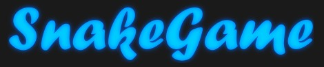
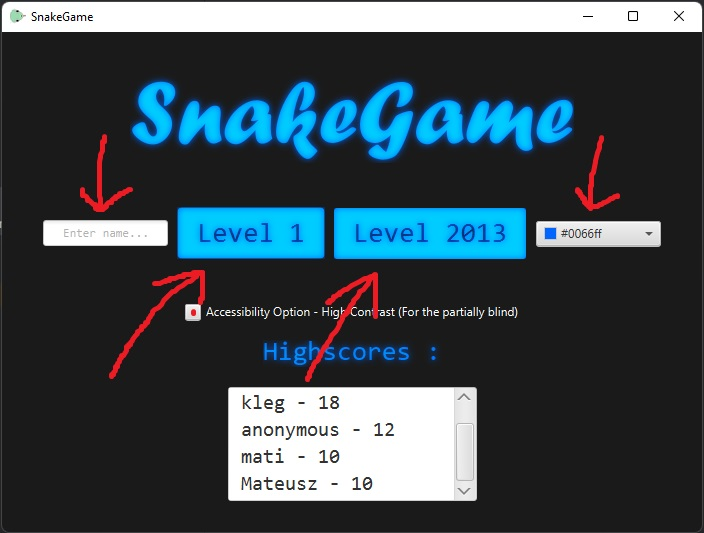

# 
 <u> COMP2013: Milestone 2 </u>

 Author: Mateusz Klocek

# 
  
# 🐍 SnakeGame: *A Modern Snake Classic* 

This project involved refactoring a snake game, updating game logic, and providing an enjoyable gaming experience. 
Some of the highlights of the game include: 

- 🐍 <u>***New Score Tracker***</u> to track progress between you and other players. 
- 🐍 <u>***Live Moving Enemies***</u> make the game more action packed and intense.
- 🐍 <u>***Personalised Ambient Colour Theme***</u> enables customisation with *16.7 million unique colours* to choose
from. (Includes quick-access high-contrast accessibility option for the visually impaired.)
- Play as the **classic snake**, swiftly avoiding the dangerous enemies, and reach sky-high high scores!

## How to Launch 🚀:
- You can run the project from source code, or use the provided with a Jar executable file. 
- Please note that to run the game, you will **require JavaFX**.
- VM Settings: (*Please replace the path to JavaFX*)
  - <code> --module-path D:\path-to-javaFX\javafx-sdk-21.0.1\lib --add-modules javafx.controls,javafx.fxml,javafx.media </code>

  
## How to Play ⏯️:
- First, [launch the game](#how-to-launch-). 
- Then you can customise your experience at the menu.
  
- Next, press the one of the two big buttons to enter either of the levels.
- Use arrow keys to control the snake.
- Use your mouse to interact with buttons on the screen.
- To exit at any time, click the window bar exit button.

## Credits:
- Credit for the '**WASTED**' death screen inspiration goes to the creators of *Grand Theft Auto*, Rockstar Games.
- Explosive icons used in this game are designed by the artist *knik1985*, sourced from OpenGameArt.org under 
CC0 (public domain) license.
- The track '*Spectre*' by Alan Walker is used under the NCS (NoCopyrightSounds) release.
- The '*Sad Music Sound Effect*' used in this game is sourced from YouTube.com and is under a no copyright license.

# 
 Thank you for playing  *SnakeGame* 🎮 

Reach out if you have any questions or need further assistance with my project!