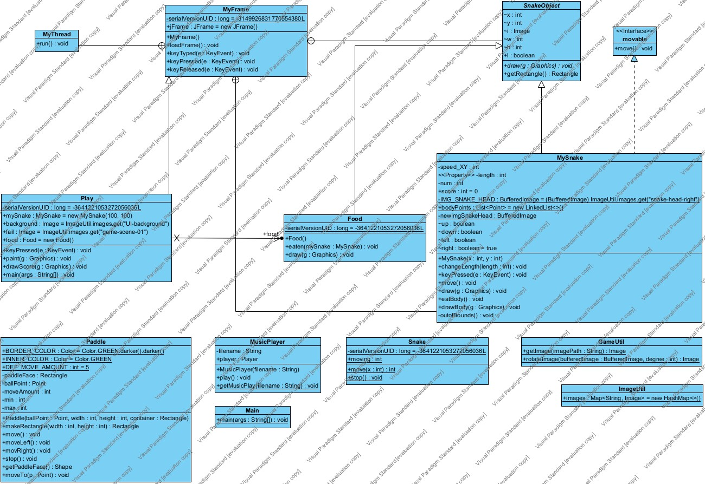
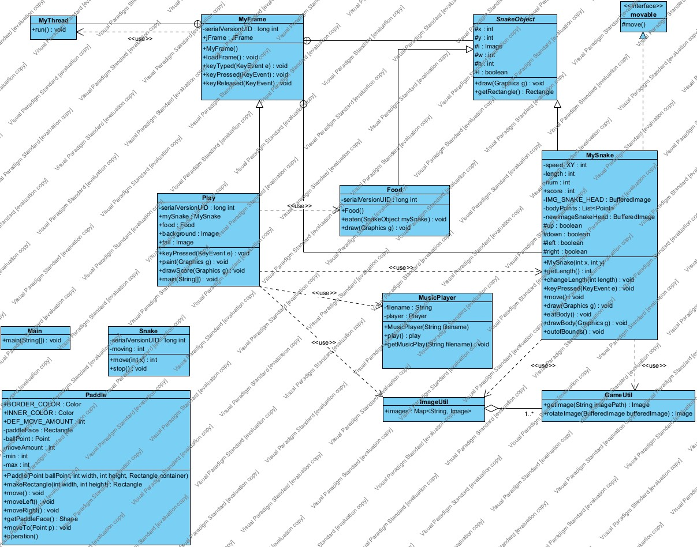
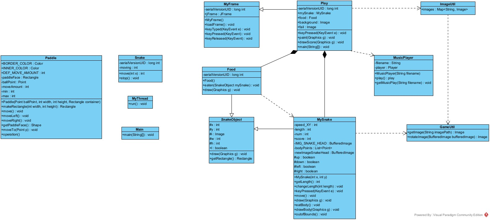
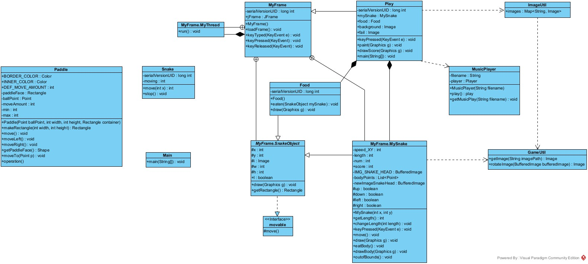
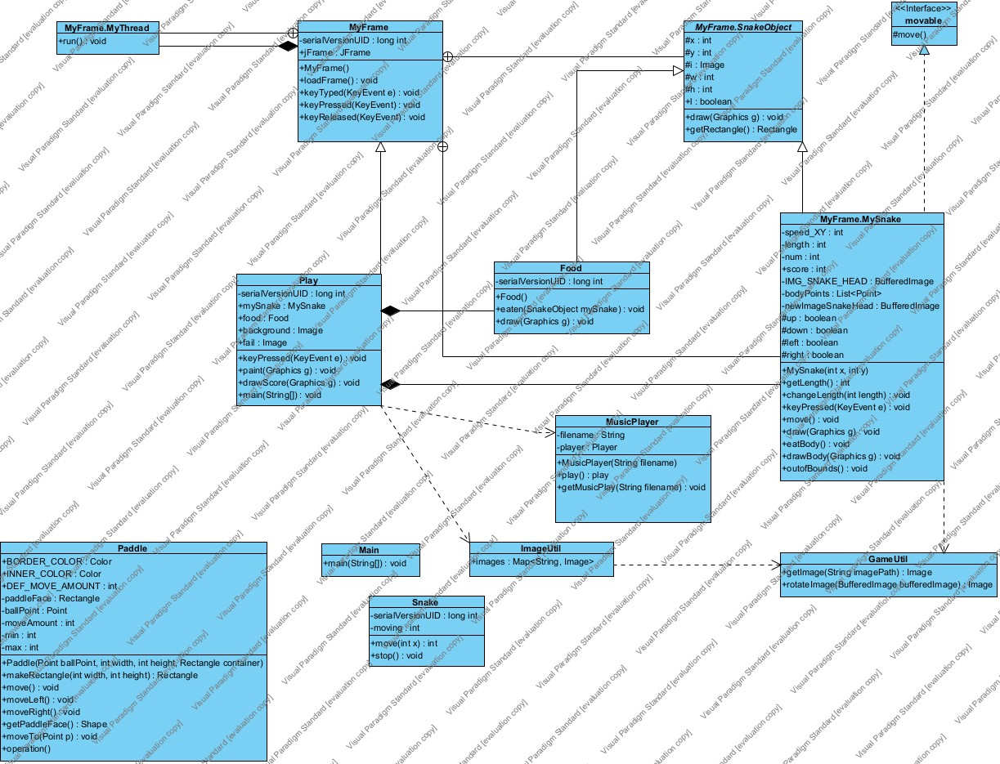

# Class Analysis

## Automatically Generated Class Diagram

- The automatically generated class diagram fails to capture some of the important relationships that the classes have.
  Below is my final class diagram that I have created based on the source code.

## My Class Diagram

- The greatest difference between my class diagram and the auto-generated one, is the existence
of relationship of aggregation between `ImageUtil` and `GameUtil`. Also, `play` has many dependencies 
on different classes such as `Food`, `MusicPlayer`, `MySnake`, and `ImageUtil`.

# Class Diagram History

## Class Diagram 1.0

- This was my initial class diagram that I produced. As you can see it grasps the fundamentals of how 
the program works, but lacks some key relationships, and even the interface!

## Class Diagram 1.1

- My second version of the class diagram that I produced. This version includes the inner class relationships.

## Class Diagram 1.2

- This class diagram matches the layout of the one that was auto-generated, as well as implementing the interface.

## Class Diagram 1.3

- Addition of `<<use>>` tags.

## Class Diagram 1.4 

- Updated the relationships based on new understanding of the relationships between the classes.

##

Go back to [Milestone 1](../milestone1/milestone1.md).

Alternatively, [go back to **project home**](../README.md)