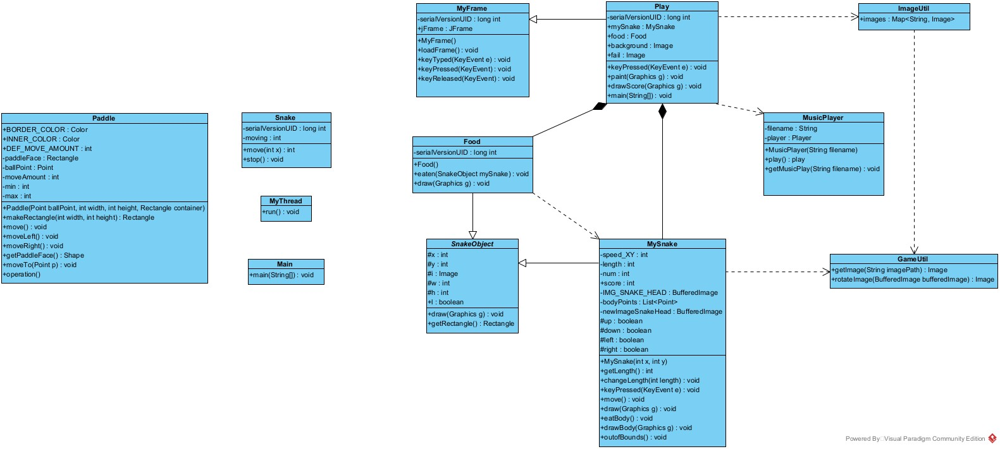

# Milestone 1

# Flow Analysis

We launch the snake game through `play.java`.
When we run the file, we instantiate a new `Play` object.
- After instantiation, a few key *instance variables* are created, namely `mySnake` : MySnake, `food` : Food, `background` : Image, `fail` : Image.
- This Play class also overrides a couple methods from its parent class, MyFrame: `keyPressed()` and `paint()`.
- A novel method is also created called `drawScore()`.

After creation of the object, the program calls a method (from the parents class, MyFrame) called `loadFrame()`.
- loadFrame, simply loads the frame.
- Specifically, it does this:
  - Sets the Play object to use a buffer to paint.
  - Adds the Play object to the JFrame.
  - Adds the Play object as a key listener of the JFrame.
  - Sets title of the frame to “Snakee Yipee”, size to (870,560), location relative to null.
  - Adds a window listener to the JFrame, that listens for if the user exits the frame using the close button.
  - Finally, it sets the frame to visible, and creates a `MyThread` object, and runs `start()` straight away.

- The `MyThread` object extends the Thread class, which schedules the threads execution, independently of the current thread.
- Execution of the thread executes the run() method, which is overridden, and is set to constantly run the repaint method every 30 ms.

# Class Analysis

*Food Usage*
Food is a class that when instantiated, creates a random food that the snake will eat.
- It’s only used inside the Play class, which initialises a random food, and then when the food is eaten, it will create another one for the snake to eat, in a random place.

*GameUtil Usage*
GameUtil is never instantiated, it is used as a utility class / helper class.
- Good that all the methods are static, meaning they can be called directly on the class.
- Doesn’t have a constructor, so we don’t need to set that to private.
- Could use final in the class (meaning it can’t be subclassed) but this is not necessary.
- The class is used for two things:
  - To get images (takes a path and returns an Image)
  - And to rotate images (takes a bufferedImage and degree of rotation, and returns a rotated image)

*ImageUtil Usage*
This class is another utility class that never gets instantiated, and its methods are available for use as they are public and static.
- The class has one attribute, a HashMap which maps Strings to Images.
- It is used inside the food class, in which it generates a random food, then maps it to the image to use for the game.
- Inside the MySnake class, it is used to return an image of the snake head and snake body.

*MusicPlayer Usage*
This class is used to… play music… nice. It is also a kind of utility class, however the constructor here is used, and is not private.
- We could change this to private, as the only call to the constructor is from within the class inside the `getMusicPlay` method.
- The getMusicPlay static method is called from the Play class, where it is used to play some music.

*MyFrame Usage*

This class is a subclass of JPanel and an interface of KeyListener.
- This class holds a few different nested classes inside of it. I am unsure if they need to be inside of the MyFrame class.
- Some of the usages of MyFrame come up as MySnake and SnakeObject usages… (CHECK)
- The constructor uses a very wierd method. CHECK
- Play class also extends/ is a subclass of MyFrame.

Paddle Usage 
- No usage.

Snake Usage
- No usage of Snake class.

Main Usage
- No usage

Play Usage
- Play is instantiated, inside of main, inside the [play.java](http://play.java) file, and then instantly runs loadFrame, which is a method of its parent class, MyFrame.

# Refactoring Notes
- Need to rename some certain attributes so that they are more concise and clear e.g. SnakeObject
- Need to make certain classes into seperate files.
- Implement MVC model.

