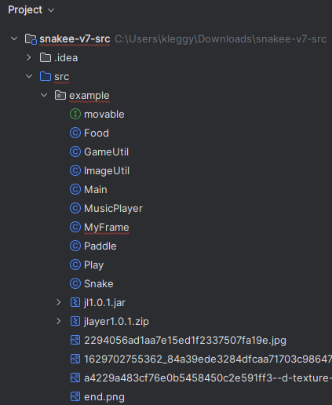
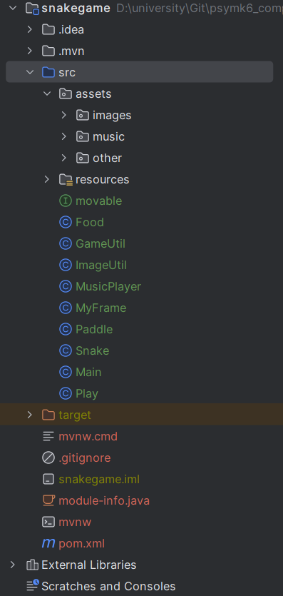
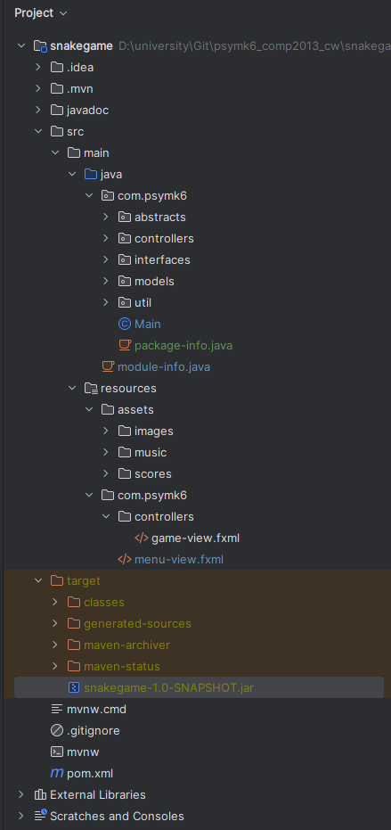

# Structure Update

## Initial Project Structure

This was the project structure of the provided source.

# 'Midway' Project Structure

This was the project structure after first attempting to refactor the game. Named 'midway' because 
it is more of a 'first steps' structure.

## Final Project Structure

This is the final project structure.

##

Go back to [Milestone 2](../milestone2/milestone2.md).

Alternatively, [go back to **project home**](../README.md)