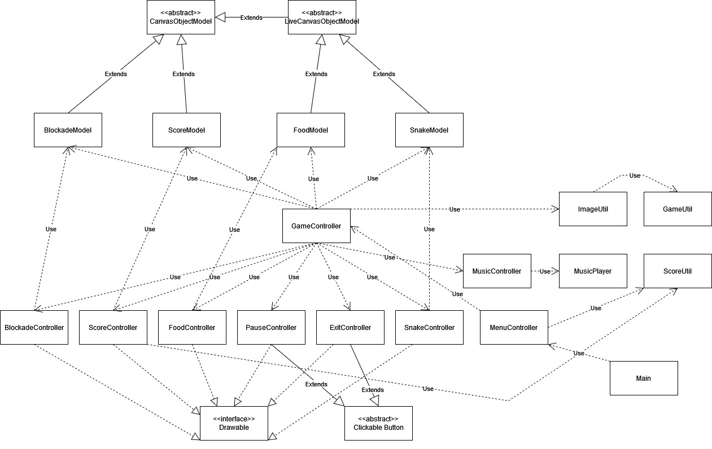
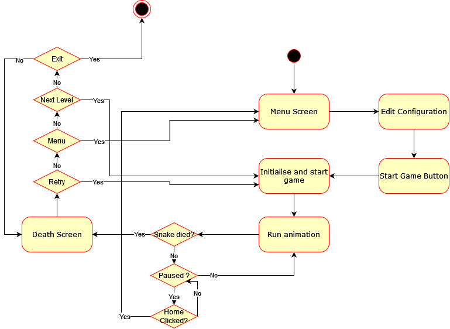

# UML Diagrams

## Final Class Diagram

This is my final class diagram. Matching the code, the GameController is by far
the busiest class of all, as it is the one that holds references to all the controllers 
and models.

## UML Activity Diagram

This is my activity diagram. It shows the workflow of the program. Specifically, it begins
at program entry point: launching the game. 
- The user is greeted with a menu screen where they can edit the configuration, and start the game
with 
- This initialises the 

##

Go back to [Milestone 2](../milestone2/milestone2.md).

Alternatively, [go back to **project home**](../README.md)